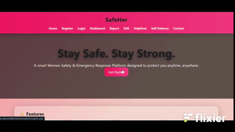

# SafeHer 🛡️

A dedicated, lightweight web platform engineered to empower women's personal safety and provide rapid emergency support. SafeHer combines rapid SOS utilities, incident documentation, verified helpline resources, and educational self-defense content into an accessible web portal.

---

## ⚡ At a Glance

| Status | Tech Stack | Target Audience | Primary Focus |
| :--- | :--- | :--- | :--- |
| 🟢 Active / v1.0 | PHP • MySQL • JS • CSS3 | Women & Students | Immediate Distress & Incident Reporting |

> **Mission:** Accessible distress alert triggers and structured safety documentation in a lightweight web interface.

---

## 🎬 Project Demo

<div align="center">
  
</div>

---

## 🎯 Problem & Objective

Accessing critical safety contacts and logging harassment or safety incidents during distress situations can be fragmented and slow. 

**SafeHer** bridges this gap by providing:
1. **Immediate Action:** One-tap emergency contact access and visual SOS alert utilities.
2. **Accountability & Tracking:** A secure portal to record incident narratives, locations, and timestamps.
3. **Preparedness & Prevention:** Accessible verified helpline directories and foundational physical safety guides.

---

## 👥 Platform Access & Modules

| Module / Feature | Guest / Public | Registered User |
| :--- | :---: | :---: |
| **Emergency SOS Center** (`sos.php`) | ✅ | ✅ |
| **Helplines Directory** (`helplines.php`) | ✅ | ✅ |
| **Self-Defense Library** (`selfdefense.php`) | ✅ | ✅ |
| **Incident Reporting** (`report.php`) | ❌ *(Sign-in required)* | ✅ |
| **Personal Dashboard** (`dashboard.php`) | ❌ *(Sign-in required)* | ✅ |

---

## ✨ Key Features

- **User Authentication:** Session-based user registration, validation, and login workflow (`register.php`, `login.php`).
- **Emergency SOS Center:** High-visibility distress page designed for fast response in emergencies (`sos.php`).
- **Incident Reporting:** Structured forms allowing users to document encounters, locations, and descriptions (`report.php`).
- **Interactive User Dashboard:** Central interface where authenticated users track their profile and view past actions (`dashboard.php`).
- **Helplines Directory:** Curated, categorical listing of emergency contact numbers (`helplines.php`).
- **Self-Defense Library:** Step-by-step instructional safety techniques and awareness advice (`selfdefense.php`).
- **Responsive Web Interface:** Lightweight, vanilla CSS styling optimized for both desktop and mobile viewports (`style.css`).

---

## 💻 Tech Stack

- **Frontend:** HTML5, CSS3, JavaScript (Vanilla)
- **Backend:** PHP (Core / Procedural)
- **Database:** MySQL
- **Local Environment:** Apache Web Server (XAMPP / WampServer)

---

## 📂 Project Architecture

```text
├── about.php          # Platform mission, vision, and team overview
├── config.php         # Database configuration & MySQL connection handle
├── contact.php        # Feedback and inquiries contact form
├── dashboard.php      # Authenticated user management portal
├── helplines.php      # Directory of emergency services & helplines
├── index.php          # Public landing page and feature highlights
├── login.php          # User sign-in interface
├── register.php       # Account creation & password hashing
├── report.php         # Incident reporting module
├── script.js          # Client-side UI toggles, DOM events, and validations
├── selfdefense.php    # Visual guides and actionable defense advice
├── sos.php            # Quick emergency trigger interface
└── style.css          # Core styling, responsive grid, and UI themes
